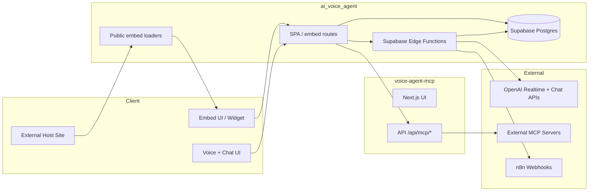
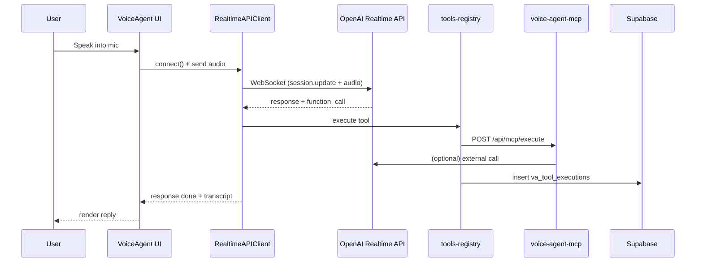
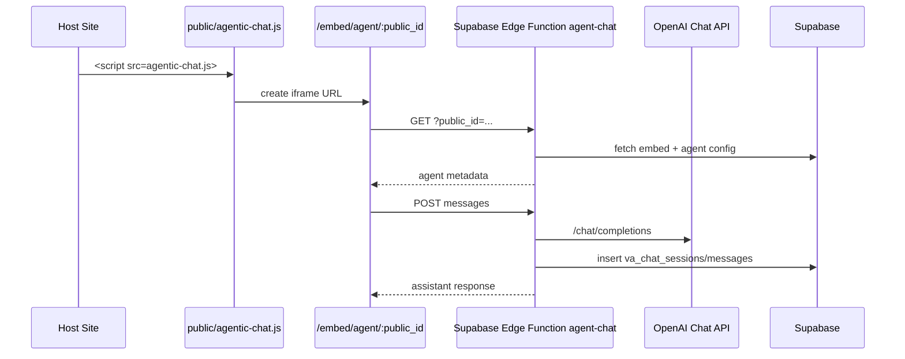
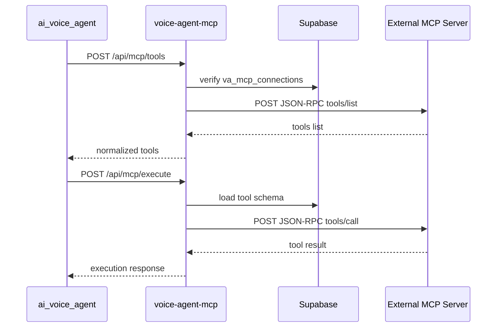
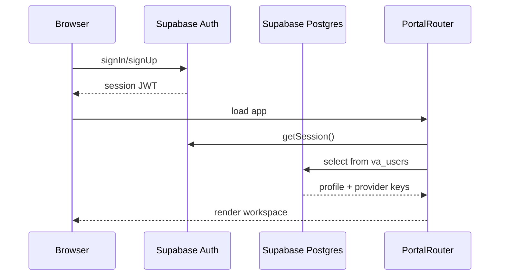

# Voice Agent Application Architecture

## 1. Overview
- Purpose: A web-based AI voice + chat agent platform that supports realtime sessions, tool execution (client/MCP/n8n), embeds, and RAG-backed knowledge bases. The main app lives in `ai_voice_agent` with Supabase Edge Functions and DB schema; embeds can run either in the same app or the dedicated `my-agent-embed` app; MCP proxy + management UI lives in `voice-agent-mcp`.
- Components:
  - `ai_voice_agent`: Vite/React SPA with voice/chat UI, Supabase integration, embed UIs, and Supabase Edge Functions/migrations.
  - `my-agent-embed`: Vite/React embed-only app for iframe/widget hosting.
  - `voice-agent-mcp`: Next.js MCP proxy + admin UI that calls external MCP servers and stores connection/tool metadata in Supabase.
- High-level diagram:



## 2. Repository Layout

### ai_voice_agent top-level folders (depth 4)

#### dist
```
dist/
|-- assets/
|   |-- index-CSJC-Bsa.js
|   `-- index-sVQ6s8sc.css
|-- agentic-chat.js
|-- audio-worklet-processor.js
|-- index.html
|-- voiceLoader.js
`-- widget.js
```

#### mcp-time-server
```
mcp-time-server/
|-- .vercel/
|   |-- project.json
|   `-- README.txt
|-- api/
|   `-- mcp.js
|-- .gitignore
`-- README.md
```

#### public
```
public/
|-- agentic-chat.js
|-- audio-worklet-processor.js
|-- voiceLoader.js
`-- widget.js
```

#### src
```
src/
|-- components/
|   |-- a2ui/
|   |   `-- A2UIRenderer.tsx
|   |-- auth/
|   |   `-- AuthScreen.tsx
|   |-- chat/
|   |   |-- AgentEmbedPanel.tsx
|   |   |-- ChatAgent.tsx
|   |   `-- ChatWidget.tsx
|   |-- conversation/
|   |   |-- ConversationThread.tsx
|   |   |-- ConversationThreadOLD.tsx
|   |   |-- MessageBubble.tsx
|   |   `-- ToolCallIndicator.tsx
|   |-- layout/
|   |   |-- MainLayout.tsx
|   |   |-- RightPanel.tsx
|   |   |-- Sidebar.tsx
|   |   |-- TopBar.tsx
|   |   `-- WorkspaceSidePanels.tsx
|   |-- panels/
|   |   |-- MCPPanel.tsx
|   |   |-- N8NPanel.tsx
|   |   `-- SettingsPanel.tsx
|   |-- portal/
|   |   |-- AgentSetupStep.tsx
|   |   |-- AgentWorkspace.tsx
|   |   `-- ProviderKeyStep.tsx
|   |-- rag/
|   |   `-- KnowledgeBaseDrawer.tsx
|   |-- session/
|   |   `-- SessionHistory.tsx
|   |-- settings/
|   |   |-- ToolSelectionPanel.tsx
|   |   `-- WebSearchSkillCard.tsx
|   |-- tools/
|   |   |-- ToolCard.tsx
|   |   `-- ToolsList.tsx
|   |-- ui/
|   |   |-- Badge.tsx
|   |   |-- Button.tsx
|   |   |-- Card.tsx
|   |   |-- LoadingScreen.tsx
|   |   `-- Separator.tsx
|   |-- usage/
|   |   |-- EmbedUsageDashboard.tsx
|   |   `-- UsageDashboard.tsx
|   |-- voice/
|   |   |-- AgentStatusBar.tsx
|   |   |-- AIAvatar.tsx
|   |   |-- AnimatedWave.tsx
|   |   |-- MicOrb.tsx
|   |   |-- MicrophoneCard.tsx
|   |   |-- StatusLabel.tsx
|   |   |-- VoiceEmbedPanel.tsx
|   |   |-- VoiceInteractionArea.tsx
|   |   |-- VoiceSilhouette.tsx
|   |   `-- WaveformLinear.tsx
|   |-- welcome/
|   |   |-- AIGlowOrb.tsx
|   |   |-- BackgroundBlobs.tsx
|   |   |-- StartSessionButton.tsx
|   |   `-- WelcomeHero.tsx
|   |-- PortalRouter.tsx
|   |-- VoiceAgent.old.tsx
|   `-- VoiceAgent.tsx
|-- context/
|   `-- AuthContext.tsx
|-- embed/
|   |-- ChatEmbedApp.tsx
|   |-- embed-api.ts
|   |-- personaplex-gateway.ts
|   |-- useEmbedChat.ts
|   |-- useVoiceEmbed.ts
|   `-- VoiceEmbedApp.tsx
|-- hooks/
|   |-- useAgentEmbed.ts
|   |-- useChatAgent.ts
|   |-- useVoiceAgent.ts
|   `-- useVoiceEmbedConfig.ts
|-- lib/
|   |-- audio-manager.ts
|   |-- audio-worklet-processor.ts
|   |-- a2ui.ts
|   |-- chat-realtime-client.ts
|   |-- chat-session-service.ts
|   |-- config-service.ts
|   |-- embed-service.ts
|   |-- invite-service.ts
|   |-- mcp-api-client.ts
|   |-- mcp-client.ts
|   |-- mcp-normalizer.ts
|   |-- n8n-service.ts
|   |-- personaplex/
|   |   `-- decoderWorker.ts
|   |-- rag-service.ts
|   |-- realtime-client.ts
|   |-- supabase.ts
|   |-- tool-utils.ts
|   |-- tools-registry.ts
|   |-- usage-pricing.ts
|   |-- usage-tracker.ts
|   |-- utils.ts
|   |-- voice-adapters/
|   |   |-- personaplex-adapter.ts
|   |   `-- types.ts
|   `-- voice-embed-service.ts
|-- marketing/
|-- state/
|   `-- agentState.ts
|-- types/
|   |-- chat.ts
|   |-- embed.ts
|   |-- rag.ts
|   |-- voice-agent.ts
|   `-- voice-embed.ts
|-- widget/
|   `-- WidgetApp.tsx
|-- App.tsx
|-- index.css
|-- main.tsx
|-- vite-env.d.ts
`-- Voice Agent Workspace.code-workspace
```

#### supabase
```
supabase/
|-- .temp/
|   `-- cli-latest
|-- functions/
|   |-- agent-chat/
|   |   `-- index.ts
|   |-- embed-service/
|   |   `-- index.ts
|   |-- embed-usage/
|   |   `-- index.ts
|   |-- external-api-call/
|   |   `-- index.ts
|   |-- invite-user/
|   |   `-- index.ts
|   |-- n8n-webhook-proxy/
|   |   `-- index.ts
|   |-- query-database/
|   |   `-- index.ts
|   |-- rag-service/
|   |   `-- index.ts
|   |-- voice-embed-service/
|   |   `-- index.ts
|   `-- voice-ephemeral-key/
|       `-- index.ts
|-- migrations/
|   |-- 20251116184923_create_voice_agent_tables.sql
|   |-- 20251116212300_create_mcp_connections_tables.sql
|   |-- 20251116221406_add_mcp_connection_health_tracking.sql
|   |-- 20251116222337_enable_mcp_tables_rls_policies.sql
|   |-- 20251116222355_enable_mcp_health_table_rls.sql
|   |-- 20251116235900_enhance_mcp_architecture.sql
|   |-- 20251117163037_create_voice_agent_tables.sql
|   |-- 20251117163055_create_mcp_connections_tables.sql
|   |-- 20251117203526_create_agent_configs_table.sql
|   |-- 20251118205401_create_agent_config_tools_table.sql
|   |-- 20251120120000_create_va_users_and_keys.sql
|   |-- 20251120120500_user_scope_enforcement.sql
|   |-- 20251120121500_user_rls_policies.sql
|   |-- 20251124174500_create_n8n_integrations.sql
|   |-- 20251125120000_create_chat_agent_tables.sql
|   |-- 20251201090000_extend_agent_config_tools.sql
|   |-- 20251201104500_expand_tool_executions_for_chat.sql
|   |-- 20251201111500_update_auth_site_url.sql
|   |-- 20251207123000_create_agent_embeds.sql
|   |-- 20251210120000_create_voice_embeds.sql
|   |-- 20251212120000_fix_tool_exec_security.sql
|   |-- 20251215101500_create_rag_schema.sql
|   |-- 20251215120000_add_voice_embed_appearance.sql
|   |-- 20251215123000_add_voice_embed_widget_settings.sql
|   |-- 20251215130000_add_voice_embed_helper_text_color.sql
|   |-- 20251215133000_add_chat_embed_appearance.sql
|   |-- 20251216120000_fix_va_provider_keys_rls_grants.sql
|   |-- 20251216121000_add_va_agent_presets_select_policy.sql
|   |-- 20251216122000_fix_search_path_and_vector_extension.sql
|   |-- 20251217120000_seed_time_mcp_tool.sql
|   |-- 20251220120000_create_usage_tracking.sql
|   |-- 20251220121500_extend_usage_sources.sql
|   `-- 20251220123000_remove_concierge_preset.sql
|-- templates/
|   `-- invite.html
`-- current_tables_scehmas.json
```

#### node_modules
```
node_modules/
|-- .bin/
|-- .vite/
|   `-- deps/
|-- @alloc/
|   `-- quick-lru/
|-- @babel/
|   |-- code-frame/
|   |   `-- lib/
|   |-- compat-data/
|   |   `-- data/
|   |-- core/
|   |   |-- lib/
|   |   |   |-- config/
|   |   |   |-- errors/
|   |   |   |-- gensync-utils/
|   |   |   |-- parser/
|   |   |   |-- tools/
|   |   |   |-- transformation/
|   |   |   `-- vendor/
|   |   `-- src/
|   |       `-- config/
|   |-- generator/
|   |   `-- lib/
|   |       |-- generators/
|   |       `-- node/
|   |-- helper-compilation-targets/
|   |   `-- lib/
|   |-- helper-globals/
|   |   `-- data/
|   |-- helper-module-imports/
|   |   `-- lib/
|   |-- helper-module-transforms/
|   |   `-- lib/
|   |-- helper-plugin-utils/
|   |   `-- lib/
|   |-- helper-string-parser/
|   |   `-- lib/
|   |-- helper-validator-identifier/
|   |   `-- lib/
|   |-- helper-validator-option/
|   |   `-- lib/
|   |-- helpers/
|   |   `-- lib/
|   |       `-- helpers/
|   |-- parser/
|   |   |-- bin/
|   |   |-- lib/
|   |   `-- typings/
|   |-- plugin-transform-react-jsx-self/
|   |   `-- lib/
|   |-- plugin-transform-react-jsx-source/
|   |   `-- lib/
|   |-- template/
|   |   `-- lib/
|   |-- traverse/
|   |   `-- lib/
|   |       |-- path/
|   |       `-- scope/
|   `-- types/
|       `-- lib/
|           |-- asserts/
|           |-- ast-types/
|           |-- builders/
|           |-- clone/
|           |-- comments/
|           |-- constants/
|           |-- converters/
|           |-- definitions/
|           |-- modifications/
|           |-- retrievers/
|           |-- traverse/
|           |-- utils/
|           `-- validators/
|-- @esbuild/
|   `-- darwin-arm64/
|       `-- bin/
|-- @eslint/
|   |-- config-array/
|   |   `-- dist/
|   |       |-- cjs/
|   |       `-- esm/
|   |-- config-helpers/
|   |   `-- dist/
|   |       |-- cjs/
|   |       `-- esm/
|   |-- core/
|   |   `-- dist/
|   |       |-- cjs/
|   |       `-- esm/
|   |-- eslintrc/
|   |   |-- conf/
|   |   |-- dist/
|   |   |-- lib/
|   |   |   |-- config-array/
|   |   |   |-- shared/
|   |   |   `-- types/
|   |   `-- node_modules/
|   |       `-- globals/
|   |-- js/
|   |   |-- src/
|   |   |   `-- configs/
|   |   `-- types/
|   |-- object-schema/
|   |   `-- dist/
|   |       |-- cjs/
|   |       `-- esm/
|   `-- plugin-kit/
|       `-- dist/
|           |-- cjs/
|           `-- esm/
|-- @eslint-community/
|   |-- eslint-utils/
|   |   `-- node_modules/
|   |       `-- eslint-visitor-keys/
|   `-- regexpp/
|-- @humanfs/
|   |-- core/
|   |   |-- dist/
|   |   `-- src/
|   `-- node/
|       |-- dist/
|       `-- src/
|-- @humanwhocodes/
|   |-- module-importer/
|   |   |-- dist/
|   |   `-- src/
|   `-- retry/
|       `-- dist/
|-- @isaacs/
|   `-- cliui/
|       `-- build/
|           `-- lib/
|-- @jridgewell/
|   |-- gen-mapping/
|   |   |-- dist/
|   |   |   `-- types/
|   |   |-- src/
|   |   `-- types/
|   |-- remapping/
|   |   |-- dist/
|   |   |-- src/
|   |   `-- types/
|   |-- resolve-uri/
|   |   `-- dist/
|   |       `-- types/
|   |-- sourcemap-codec/
|   |   |-- dist/
|   |   |-- src/
|   |   `-- types/
|   `-- trace-mapping/
|       |-- dist/
|       |-- src/
|       `-- types/
|-- @nodelib/
|   |-- fs.scandir/
|   |   `-- out/
|   |       |-- adapters/
|   |       |-- providers/
|   |       |-- types/
|   |       `-- utils/
|   |-- fs.stat/
|   |   `-- out/
|   |       |-- adapters/
|   |       |-- providers/
|   |       `-- types/
|   `-- fs.walk/
|       `-- out/
|           |-- providers/
|           |-- readers/
|           `-- types/
|-- @pkgjs/
|   `-- parseargs/
|       |-- examples/
|       `-- internal/
|-- @reactflow/
|   |-- background/
|   |   `-- dist/
|   |       |-- esm/
|   |       `-- umd/
|   |-- controls/
|   |   `-- dist/
|   |       |-- esm/
|   |       `-- umd/
|   |-- core/
|   |   `-- dist/
|   |       |-- esm/
|   |       `-- umd/
|   |-- minimap/
|   |   `-- dist/
|   |       |-- esm/
|   |       `-- umd/
|   |-- node-resizer/
|   |   `-- dist/
|   |       |-- esm/
|   |       `-- umd/
|   `-- node-toolbar/
|       `-- dist/
|           |-- esm/
|           `-- umd/
|-- @rolldown/
|   `-- pluginutils/
|       `-- dist/
|-- @rollup/
|   `-- rollup-darwin-arm64/
|-- @supabase/
|   |-- auth-js/
|   |   |-- dist/
|   |   |   |-- main/
|   |   |   `-- module/
|   |   `-- src/
|   |       `-- lib/
|   |-- functions-js/
|   |   |-- dist/
|   |   |   |-- main/
|   |   |   `-- module/
|   |   `-- src/
|   |-- postgrest-js/
|   |   |-- dist/
|   |   |   |-- cjs/
|   |   |   `-- esm/
|   |   `-- src/
|   |       |-- select-query-parser/
|   |       `-- types/
|   |-- realtime-js/
|   |   |-- dist/
|   |   |   |-- main/
|   |   |   `-- module/
|   |   `-- src/
|   |       `-- lib/
|   |-- storage-js/
|   |   |-- dist/
|   |   |   |-- main/
|   |   |   |-- module/
|   |   |   `-- umd/
|   |   `-- src/
|   |       |-- lib/
|   |       `-- packages/
|   `-- supabase-js/
|       |-- dist/
|       |   |-- main/
|       |   |-- module/
|       |   `-- umd/
|       `-- src/
|           `-- lib/
|-- @types/
|   |-- babel__core/
|   |-- babel__generator/
|   |-- babel__template/
|   |-- babel__traverse/
|   |-- d3/
|   |-- d3-array/
|   |-- d3-axis/
|   |-- d3-brush/
|   |-- d3-chord/
|   |-- d3-color/
|   |-- d3-contour/
|   |-- d3-delaunay/
|   |-- d3-dispatch/
|   |-- d3-drag/
|   |-- d3-dsv/
|   |-- d3-ease/
|   |-- d3-fetch/
|   |-- d3-force/
|   |-- d3-format/
|   |-- d3-geo/
|   |-- d3-hierarchy/
|   |-- d3-interpolate/
|   |-- d3-path/
|   |-- d3-polygon/
|   |-- d3-quadtree/
|   |-- d3-random/
|   |-- d3-scale/
|   |-- d3-scale-chromatic/
|   |-- d3-selection/
|   |-- d3-shape/
|   |-- d3-time/
|   |-- d3-time-format/
|   |-- d3-timer/
|   |-- d3-transition/
|   |-- d3-zoom/
|   |-- estree/
|   |-- geojson/
|   |-- json-schema/
|   |-- node/
|   |   |-- assert/
|   |   |-- compatibility/
|   |   |-- dns/
|   |   |-- fs/
|   |   |-- readline/
|   |   |-- stream/
|   |   |-- timers/
|   |   |-- ts5.6/
|   |   |   `-- compatibility/
|   |   |-- ts5.7/
|   |   |   `-- compatibility/
|   |   `-- web-globals/
|   |-- phoenix/
|   |-- prop-types/
|   |-- react/
|   |   `-- ts5.0/
|   |-- react-dom/
|   |   `-- test-utils/
|   `-- ws/
|-- @typescript-eslint/
|   |-- eslint-plugin/
|   |   |-- dist/
|   |   |   |-- configs/
|   |   |   |-- rules/
|   |   |   `-- util/
|   |   `-- node_modules/
|   |       `-- ignore/
|   |-- parser/
|   |   `-- dist/
|   |-- project-service/
|   |   `-- dist/
|   |-- scope-manager/
|   |   `-- dist/
|   |       |-- definition/
|   |       |-- lib/
|   |       |-- referencer/
|   |       |-- scope/
|   |       `-- variable/
|   |-- tsconfig-utils/
|   |   `-- dist/
|   |-- type-utils/
|   |   `-- dist/
|   |       `-- typeOrValueSpecifiers/
|   |-- types/
|   |   `-- dist/
|   |       `-- generated/
|   |-- typescript-estree/
|   |   |-- dist/
|   |   |   |-- create-program/
|   |   |   |-- jsx/
|   |   |   |-- parseSettings/
|   |   |   `-- ts-estree/
|   |   `-- node_modules/
|   |       |-- .bin/
|   |       |-- brace-expansion/
|   |       |-- minimatch/
|   |       `-- semver/
|   |-- utils/
|   |   `-- dist/
|   |       |-- ast-utils/
|   |       |-- eslint-utils/
|   |       |-- ts-eslint/
|   |       `-- ts-utils/
|   `-- visitor-keys/
|       `-- dist/
|-- @vitejs/
|   `-- plugin-react/
|       `-- dist/
|-- acorn/
|   |-- bin/
|   `-- dist/
|-- acorn-jsx/
|-- ajv/
|   |-- dist/
|   |-- lib/
|   |   |-- compile/
|   |   |-- dot/
|   |   |-- dotjs/
|   |   `-- refs/
|   `-- scripts/
|-- ansi-regex/
|-- ansi-styles/
|-- any-promise/
|   `-- register/
|-- anymatch/
|-- arg/
|-- argparse/
|   `-- lib/
|-- autoprefixer/
|   |-- bin/
|   |-- data/
|   `-- lib/
|       `-- hacks/
|-- balanced-match/
|   `-- .github/
|-- baseline-browser-mapping/
|   `-- dist/
|-- binary-extensions/
|-- brace-expansion/
|-- braces/
|   `-- lib/
|-- browserslist/
|-- callsites/
|-- camelcase-css/
|-- caniuse-lite/
|   |-- data/
|   |   |-- features/
|   |   `-- regions/
|   `-- dist/
|       |-- lib/
|       `-- unpacker/
|-- chalk/
|   `-- source/
|-- chokidar/
|   |-- lib/
|   |-- node_modules/
|   |   `-- glob-parent/
|   `-- types/
|-- classcat/
|-- clsx/
|   `-- dist/
|-- color-convert/
|-- color-name/
|-- commander/
|   `-- typings/
|-- concat-map/
|   |-- example/
|   `-- test/
|-- convert-source-map/
|-- cross-spawn/
|   `-- lib/
|       `-- util/
|-- cssesc/
|   |-- bin/
|   `-- man/
|-- csstype/
|-- d3-color/
|   |-- dist/
|   `-- src/
|-- d3-dispatch/
|   |-- dist/
|   `-- src/
|-- d3-drag/
|   |-- dist/
|   `-- src/
|-- d3-ease/
|   |-- dist/
|   `-- src/
|-- d3-interpolate/
|   |-- dist/
|   `-- src/
|       `-- transform/
|-- d3-selection/
|   |-- dist/
|   `-- src/
|       `-- selection/
|-- d3-timer/
|   |-- dist/
|   `-- src/
|-- d3-transition/
|   |-- dist/
|   `-- src/
|       |-- selection/
|       `-- transition/
|-- d3-zoom/
|   |-- dist/
|   `-- src/
|-- debug/
|   `-- src/
|-- deep-is/
|   |-- example/
|   `-- test/
|-- didyoumean/
|-- dlv/
|   `-- dist/
|-- eastasianwidth/
|-- electron-to-chromium/
|-- emoji-regex/
|   `-- es2015/
|-- esbuild/
|   |-- bin/
|   `-- lib/
|-- escalade/
|   |-- dist/
|   `-- sync/
|-- escape-string-regexp/
|-- eslint/
|   |-- bin/
|   |-- conf/
|   |-- lib/
|   |   |-- cli-engine/
|   |   |   `-- formatters/
|   |   |-- config/
|   |   |-- eslint/
|   |   |-- languages/
|   |   |   `-- js/
|   |   |-- linter/
|   |   |   `-- code-path-analysis/
|   |   |-- rule-tester/
|   |   |-- rules/
|   |   |   `-- utils/
|   |   |-- services/
|   |   |-- shared/
|   |   `-- types/
|   `-- messages/
|-- eslint-plugin-react-hooks/
|   `-- cjs/
|-- eslint-plugin-react-refresh/
|-- eslint-scope/
|   |-- dist/
|   `-- lib/
|-- eslint-visitor-keys/
|   |-- dist/
|   `-- lib/
|-- espree/
|   |-- dist/
|   `-- lib/
|-- esquery/
|   `-- dist/
|-- esrecurse/
|-- estraverse/
|-- esutils/
|   `-- lib/
|-- fast-deep-equal/
|   `-- es6/
|-- fast-glob/
|   |-- node_modules/
|   |   `-- glob-parent/
|   `-- out/
|       |-- managers/
|       |-- providers/
|       |   |-- filters/
|       |   |-- matchers/
|       |   `-- transformers/
|       |-- readers/
|       |-- types/
|       `-- utils/
|-- fast-json-stable-stringify/
|   |-- .github/
|   |-- benchmark/
|   |-- example/
|   `-- test/
|-- fast-levenshtein/
|-- fastq/
|   |-- .github/
|   |   `-- workflows/
|   `-- test/
|-- file-entry-cache/
|-- fill-range/
|-- find-up/
|-- flat-cache/
|   `-- src/
|-- flatted/
|   |-- cjs/
|   |-- esm/
|   |-- php/
|   |-- python/
|   `-- types/
|-- foreground-child/
|   `-- dist/
|       |-- commonjs/
|       `-- esm/
|-- fraction.js/
|   |-- dist/
|   |-- examples/
|   |-- src/
|   `-- tests/
|-- framer-motion/
|   |-- client/
|   |-- dist/
|   |   |-- cjs/
|   |   |-- es/
|   |   |   |-- animation/
|   |   |   |-- components/
|   |   |   |-- context/
|   |   |   |-- events/
|   |   |   |-- gestures/
|   |   |   |-- motion/
|   |   |   |-- projection/
|   |   |   |-- render/
|   |   |   |-- utils/
|   |   |   `-- value/
|   |   `-- types/
|   |-- dom/
|   |   `-- mini/
|   |-- m/
|   `-- mini/
|-- fsevents/
|-- function-bind/
|   |-- .github/
|   `-- test/
|-- gensync/
|   `-- test/
|-- glob/
|   |-- dist/
|   |   |-- commonjs/
|   |   `-- esm/
|   `-- node_modules/
|       |-- brace-expansion/
|       |   `-- .github/
|       `-- minimatch/
|           `-- dist/
|-- glob-parent/
|-- globals/
|-- graphemer/
|   `-- lib/
|-- has-flag/
|-- hasown/
|   `-- .github/
|-- ignore/
|-- import-fresh/
|-- imurmurhash/
|-- is-binary-path/
|-- is-core-module/
|   `-- test/
|-- is-extglob/
|-- is-fullwidth-code-point/
|-- is-glob/
|-- is-number/
|-- isexe/
|   `-- test/
|-- jackspeak/
|   `-- dist/
|       |-- commonjs/
|       `-- esm/
|-- jiti/
|   |-- bin/
|   |-- dist/
|   |   `-- plugins/
|   `-- lib/
|-- js-tokens/
|-- js-yaml/
|   |-- bin/
|   |-- dist/
|   `-- lib/
|       |-- schema/
|       `-- type/
|-- jsesc/
|   |-- bin/
|   `-- man/
|-- json-buffer/
|   `-- test/
|-- json-schema-traverse/
|   `-- spec/
|       `-- fixtures/
|-- json-stable-stringify-without-jsonify/
|   |-- example/
|   `-- test/
|-- json5/
|   |-- dist/
|   `-- lib/
|-- keyv/
|   `-- src/
|-- levn/
|   `-- lib/
|-- lilconfig/
|   `-- src/
|-- lines-and-columns/
|   `-- build/
|-- locate-path/
|-- lodash.merge/
|-- loose-envify/
|-- lru-cache/
|-- lucide-react/
|   `-- dist/
|       |-- cjs/
|       |-- esm/
|       |   `-- icons/
|       `-- umd/
|-- merge2/
|-- micromatch/
|-- minimatch/
|-- minipass/
|   `-- dist/
|       |-- commonjs/
|       `-- esm/
|-- motion-dom/
|   `-- dist/
|       |-- cjs/
|       `-- es/
|           |-- animation/
|           |-- effects/
|           |-- frameloop/
|           |-- gestures/
|           |-- render/
|           |-- resize/
|           |-- scroll/
|           |-- stats/
|           |-- utils/
|           |-- value/
|           `-- view/
|-- motion-utils/
|   `-- dist/
|       |-- cjs/
|       `-- es/
|           `-- easing/
|-- ms/
|-- mz/
|-- nanoid/
|   |-- async/
|   |-- bin/
|   |-- non-secure/
|   `-- url-alphabet/
|-- natural-compare/
|-- node-releases/
|   `-- data/
|       |-- processed/
|       `-- release-schedule/
|-- normalize-path/
|-- normalize-range/
|-- object-assign/
|-- object-hash/
|   `-- dist/
|-- optionator/
|   `-- lib/
|-- p-limit/
|-- p-locate/
|-- package-json-from-dist/
|   `-- dist/
|       |-- commonjs/
|       `-- esm/
|-- parent-module/
|-- path-exists/
|-- path-key/
|-- path-parse/
|-- path-scurry/
|   |-- dist/
|   |   |-- commonjs/
|   |   `-- esm/
|   `-- node_modules/
|       `-- lru-cache/
|           `-- dist/
|-- picocolors/
|-- picomatch/
|   `-- lib/
|-- pify/
|-- pirates/
|   `-- lib/
|-- postcss/
|   `-- lib/
|-- postcss-import/
|   `-- lib/
|-- postcss-js/
|-- postcss-load-config/
|   `-- src/
|-- postcss-nested/
|-- postcss-selector-parser/
|   `-- dist/
|       |-- selectors/
|       `-- util/
|-- postcss-value-parser/
|   `-- lib/
|-- prelude-ls/
|   `-- lib/
|-- punycode/
|-- queue-microtask/
|-- react/
|   |-- cjs/
|   `-- umd/
|-- react-dom/
|   |-- cjs/
|   `-- umd/
|-- react-refresh/
|   `-- cjs/
|-- reactflow/
|   `-- dist/
|       |-- esm/
|       `-- umd/
|-- read-cache/
|-- readdirp/
|-- resolve/
|   |-- .github/
|   |-- bin/
|   |-- example/
|   |-- lib/
|   `-- test/
|       |-- dotdot/
|       |   `-- abc/
|       |-- module_dir/
|       |   |-- xmodules/
|       |   |-- ymodules/
|       |   `-- zmodules/
|       |-- node_path/
|       |   |-- x/
|       |   `-- y/
|       |-- pathfilter/
|       |   `-- deep_ref/
|       |-- precedence/
|       |   |-- aaa/
|       |   `-- bbb/
|       |-- resolver/
|       |   |-- baz/
|       |   |-- browser_field/
|       |   |-- dot_main/
|       |   |-- dot_slash_main/
|       |   |-- false_main/
|       |   |-- incorrect_main/
|       |   |-- invalid_main/
|       |   |-- multirepo/
|       |   |-- nested_symlinks/
|       |   |-- other_path/
|       |   |-- quux/
|       |   |-- same_names/
|       |   |-- symlinked/
|       |   `-- without_basedir/
|       `-- shadowed_core/
|           `-- node_modules/
|-- resolve-from/
|-- reusify/
|   |-- .github/
|   |   `-- workflows/
|   `-- benchmarks/
|-- rollup/
|   `-- dist/
|       |-- bin/
|       |-- es/
|       |   `-- shared/
|       `-- shared/
|-- run-parallel/
|-- scheduler/
|   |-- cjs/
|   `-- umd/
|-- semver/
|   `-- bin/
|-- shebang-command/
|-- shebang-regex/
|-- signal-exit/
|   `-- dist/
|       |-- cjs/
|       `-- mjs/
|-- source-map-js/
|   `-- lib/
|-- string-width/
|-- string-width-cjs/
|   `-- node_modules/
|       |-- ansi-regex/
|       |-- emoji-regex/
|       |   `-- es2015/
|       `-- strip-ansi/
|-- strip-ansi/
|-- strip-ansi-cjs/
|   `-- node_modules/
|       `-- ansi-regex/
|-- strip-json-comments/
|-- sucrase/
|   |-- bin/
|   |-- dist/
|   |   |-- esm/
|   |   |   |-- parser/
|   |   |   |-- transformers/
|   |   |   `-- util/
|   |   |-- parser/
|   |   |   |-- plugins/
|   |   |   |-- tokenizer/
|   |   |   |-- traverser/
|   |   |   `-- util/
|   |   |-- transformers/
|   |   |-- types/
|   |   |   |-- parser/
|   |   |   |-- transformers/
|   |   |   `-- util/
|   |   `-- util/
|   |-- register/
|   `-- ts-node-plugin/
|-- supports-color/
|-- supports-preserve-symlinks-flag/
|   |-- .github/
|   `-- test/
|-- tailwind-merge/
|   |-- dist/
|   |   `-- es5/
|   `-- src/
|       `-- lib/
|-- tailwindcss/
|   |-- lib/
|   |   |-- cli/
|   |   |   |-- build/
|   |   |   |-- help/
|   |   |   `-- init/
|   |   |-- css/
|   |   |-- lib/
|   |   |-- postcss-plugins/
|   |   |   `-- nesting/
|   |   |-- public/
|   |   |-- util/
|   |   `-- value-parser/
|   |-- nesting/
|   |-- peers/
|   |-- scripts/
|   |-- src/
|   |   |-- cli/
|   |   |   |-- build/
|   |   |   |-- help/
|   |   |   `-- init/
|   |   |-- css/
|   |   |-- lib/
|   |   |-- postcss-plugins/
|   |   |   `-- nesting/
|   |   |-- public/
|   |   |-- util/
|   |   `-- value-parser/
|   |-- stubs/
|   `-- types/
|       `-- generated/
|-- thenify/
|-- thenify-all/
|-- to-regex-range/
|-- ts-api-utils/
|   `-- lib/
|-- ts-interface-checker/
|   `-- dist/
|-- tslib/
|   `-- modules/
|-- type-check/
|   `-- lib/
|-- typescript/
|   |-- bin/
|   `-- lib/
|       |-- cs/
|       |-- de/
|       |-- es/
|       |-- fr/
|       |-- it/
|       |-- ja/
|       |-- ko/
|       |-- pl/
|       |-- pt-br/
|       |-- ru/
|       |-- tr/
|       |-- zh-cn/
|       `-- zh-tw/
|-- typescript-eslint/
|   `-- dist/
|-- undici-types/
|-- update-browserslist-db/
|-- uri-js/
|   `-- dist/
|       |-- es5/
|       `-- esnext/
|           `-- schemes/
|-- use-sync-external-store/
|   |-- cjs/
|   |   `-- use-sync-external-store-shim/
|   `-- shim/
|-- util-deprecate/
|-- vite/
|   |-- bin/
|   |-- dist/
|   |   |-- client/
|   |   |-- node/
|   |   |   `-- chunks/
|   |   `-- node-cjs/
|   `-- types/
|-- which/
|   `-- bin/
|-- word-wrap/
|-- wrap-ansi/
|   `-- node_modules/
|       `-- ansi-styles/
|-- wrap-ansi-cjs/
|   `-- node_modules/
|       |-- ansi-regex/
|       |-- emoji-regex/
|       |   `-- es2015/
|       |-- string-width/
|       `-- strip-ansi/
|-- ws/
|   `-- lib/
|-- yallist/
|-- yocto-queue/
`-- zustand/
    |-- esm/
    |   |-- middleware/
    |   |-- react/
    |   `-- vanilla/
    |-- middleware/
    |-- react/
    |-- system/
    |   |-- middleware/
    |   |-- react/
    |   `-- vanilla/
    |-- ts3.4/
    |   |-- esm/
    |   |   |-- middleware/
    |   |   |-- react/
    |   |   `-- vanilla/
    |   |-- middleware/
    |   |-- react/
    |   `-- vanilla/
    |-- umd/
    |   |-- middleware/
    |   |-- react/
    |   `-- vanilla/
    `-- vanilla/
```

#### .git
```
.git/
|-- branches/
|-- hooks/
|-- info/
|-- logs/
|   `-- refs/
|       |-- heads/
|       `-- remotes/
|           `-- origin/
|-- objects/
|   |-- 00/
|   |-- 01/
|   |-- 02/
|   |-- 03/
|   |-- 04/
|   |-- 05/
|   |-- 06/
|   |-- 07/
|   |-- 08/
|   |-- 09/
|   |-- 0a/
|   |-- 0b/
|   |-- 0c/
|   |-- 0d/
|   |-- 0e/
|   |-- 0f/
|   |-- 10/
|   |-- 11/
|   |-- 12/
|   |-- 13/
|   |-- 14/
|   |-- 15/
|   |-- 16/
|   |-- 17/
|   |-- 18/
|   |-- 19/
|   |-- 1a/
|   |-- 1b/
|   |-- 1c/
|   |-- 1d/
|   |-- 1e/
|   |-- 1f/
|   |-- 20/
|   |-- 21/
|   |-- 22/
|   |-- 23/
|   |-- 24/
|   |-- 25/
|   |-- 26/
|   |-- 27/
|   |-- 28/
|   |-- 29/
|   |-- 2a/
|   |-- 2b/
|   |-- 2c/
|   |-- 2d/
|   |-- 2e/
|   |-- 2f/
|   |-- 30/
|   |-- 31/
|   |-- 32/
|   |-- 33/
|   |-- 34/
|   |-- 35/
|   |-- 36/
|   |-- 37/
|   |-- 38/
|   |-- 39/
|   |-- 3a/
|   |-- 3b/
|   |-- 3c/
|   |-- 3d/
|   |-- 3e/
|   |-- 3f/
|   |-- 40/
|   |-- 41/
|   |-- 42/
|   |-- 43/
|   |-- 44/
|   |-- 45/
|   |-- 46/
|   |-- 47/
|   |-- 48/
|   |-- 49/
|   |-- 4a/
|   |-- 4b/
|   |-- 4c/
|   |-- 4d/
|   |-- 4e/
|   |-- 4f/
|   |-- 50/
|   |-- 51/
|   |-- 52/
|   |-- 53/
|   |-- 54/
|   |-- 55/
|   |-- 56/
|   |-- 57/
|   |-- 58/
|   |-- 59/
|   |-- 5a/
|   |-- 5b/
|   |-- 5c/
|   |-- 5d/
|   |-- 5e/
|   |-- 5f/
|   |-- 60/
|   |-- 61/
|   |-- 62/
|   |-- 63/
|   |-- 64/
|   |-- 65/
|   |-- 66/
|   |-- 67/
|   |-- 68/
|   |-- 69/
|   |-- 6a/
|   |-- 6b/
|   |-- 6c/
|   |-- 6d/
|   |-- 6e/
|   |-- 6f/
|   |-- 70/
|   |-- 71/
|   |-- 72/
|   |-- 73/
|   |-- 74/
|   |-- 75/
|   |-- 76/
|   |-- 77/
|   |-- 78/
|   |-- 79/
|   |-- 7a/
|   |-- 7b/
|   |-- 7c/
|   |-- 7d/
|   |-- 7e/
|   |-- 7f/
|   |-- 80/
|   |-- 81/
|   |-- 82/
|   |-- 83/
|   |-- 84/
|   |-- 85/
|   |-- 86/
|   |-- 87/
|   |-- 88/
|   |-- 89/
|   |-- 8a/
|   |-- 8b/
|   |-- 8c/
|   |-- 8d/
|   |-- 8e/
|   |-- 8f/
|   |-- 90/
|   |-- 91/
|   |-- 92/
|   |-- 93/
|   |-- 94/
|   |-- 95/
|   |-- 96/
|   |-- 97/
|   |-- 98/
|   |-- 99/
|   |-- 9a/
|   |-- 9b/
|   |-- 9c/
|   |-- 9d/
|   |-- 9e/
|   |-- 9f/
|   |-- a0/
|   |-- a1/
|   |-- a2/
|   |-- a3/
|   |-- a4/
|   |-- a5/
|   |-- a6/
|   |-- a7/
|   |-- a8/
|   |-- a9/
|   |-- aa/
|   |-- ab/
|   |-- ac/
|   |-- ad/
|   |-- ae/
|   |-- af/
|   |-- b0/
|   |-- b1/
|   |-- b2/
|   |-- b3/
|   |-- b4/
|   |-- b5/
|   |-- b6/
|   |-- b7/
|   |-- b8/
|   |-- b9/
|   |-- ba/
|   |-- bb/
|   |-- bc/
|   |-- bd/
|   |-- be/
|   |-- bf/
|   |-- c0/
|   |-- c1/
|   |-- c2/
|   |-- c3/
|   |-- c4/
|   |-- c5/
|   |-- c6/
|   |-- c7/
|   |-- c8/
|   |-- c9/
|   |-- ca/
|   |-- cb/
|   |-- cc/
|   |-- cd/
|   |-- ce/
|   |-- cf/
|   |-- d0/
|   |-- d1/
|   |-- d2/
|   |-- d3/
|   |-- d4/
|   |-- d5/
|   |-- d6/
|   |-- d7/
|   |-- d8/
|   |-- d9/
|   |-- da/
|   |-- db/
|   |-- dc/
|   |-- dd/
|   |-- de/
|   |-- df/
|   |-- e0/
|   |-- e1/
|   |-- e2/
|   |-- e3/
|   |-- e4/
|   |-- e5/
|   |-- e6/
|   |-- e7/
|   |-- e8/
|   |-- e9/
|   |-- ea/
|   |-- eb/
|   |-- ec/
|   |-- ed/
|   |-- ee/
|   |-- ef/
|   |-- f0/
|   |-- f1/
|   |-- f2/
|   |-- f3/
|   |-- f4/
|   |-- f5/
|   |-- f6/
|   |-- f7/
|   |-- f8/
|   |-- f9/
|   |-- fa/
|   |-- fb/
|   |-- fc/
|   |-- fd/
|   |-- fe/
|   |-- ff/
|   |-- info/
|   `-- pack/
`-- refs/
    |-- heads/
    |-- remotes/
    |   `-- origin/
    `-- tags/
```

Notes: `node_modules` and `.git` are large; the tree above is directory-only at depth 4 to keep this document readable.

### What each top-level folder is for (ai_voice_agent)
- `dist`: Vite production build output (bundled JS/CSS + static loaders).
- `mcp-time-server`: Standalone Vercel serverless MCP time tool (`api/mcp.js`).
- `public`: Static loader scripts for embeds and widgets (served as-is).
- `src`: Application source (UI, hooks, embed runtime, tool registry, state).
- `supabase`: Edge functions, migrations, templates, and schema snapshots.
- `node_modules`: Dependency tree installed by npm.
- `.git`: Git metadata for version control.

### my-agent-embed (sibling repo) tree (depth 4)

#### src
```
src/
|-- assets/
|   `-- react.svg
|-- components/
|   |-- a2ui/
|   |   `-- A2UIRenderer.tsx
|   `-- ui/
|       `-- Button.tsx
|-- embed/
|   |-- ChatEmbedApp.tsx
|   |-- embed-api.ts
|   |-- useEmbedChat.ts
|   |-- useVoiceEmbed.ts
|   `-- VoiceEmbedApp.tsx
|-- lib/
|   |-- a2ui.ts
|   |-- audio-manager.ts
|   |-- audio-worklet-processor.ts
|   |-- mcp-api-client.ts
|   |-- mcp-normalizer.ts
|   |-- n8n-service.ts
|   |-- realtime-client.ts
|   |-- supabase.ts
|   |-- tool-utils.ts
|   |-- tools-registry.ts
|   `-- utils.ts
|-- types/
|   |-- rag.ts
|   `-- voice-agent.ts
|-- widget/
|   `-- WidgetApp.tsx
|-- App.tsx
|-- index.css
`-- main.tsx
```

#### public
```
public/
|-- agentic-chat.js
|-- audio-worklet-processor.js
|-- bootstrapLoader.js
|-- vite.svg
|-- voiceLoader.js
`-- widget.js
```

#### dist
```
dist/
|-- assets/
|   |-- index-7swTC2Q9.js
|   |-- index-BFWfx377.css
|   `-- react-CHdo91hT.svg
|-- bootstrapLoader.js
|-- index.html
|-- vite.svg
`-- widget.js
```

### What each top-level folder is for (my-agent-embed)
- `src`: Embed UI source and tool clients.
- `public`: Loader scripts and static assets.
- `dist`: Production build output.

### voice-agent-mcp (sibling repo) tree (depth 4)

#### app
```
app/
|-- api/
|   `-- mcp/
|       |-- connections/
|       |   `-- route.ts
|       |-- execute/
|       |   `-- route.ts
|       |-- test/
|       |   `-- route.ts
|       `-- tools/
|           `-- route.ts
|-- mcp/
|   |-- add/
|   |   `-- page.tsx
|   |-- list/
|   |   `-- page.tsx
|   `-- tools/
|       `-- [connection_id]/
|           `-- page.tsx
|-- favicon.ico
|-- globals.css
|-- layout.tsx
`-- page.tsx
```

#### lib
```
lib/
|-- cors.ts
|-- db.ts
|-- mcp-client.ts
|-- mcp-normalizer.ts
|-- types.ts
`-- utils.ts
```

#### public
```
public/
|-- file.svg
|-- globe.svg
|-- logo.svg
|-- next.svg
|-- vercel.svg
`-- window.svg
```

### What each top-level folder is for (voice-agent-mcp)
- `app`: Next.js App Router pages and API routes.
- `lib`: Shared MCP helpers, CORS, and DB client.
- `public`: Static assets.

## 3. Component Deep Dives

### 3.1 ai_voice_agent

#### What it is
- A Vite + React single-page application with embedded routes and a Supabase-backed backend (Edge Functions + Postgres).

#### How it starts
- `npm run dev` (Vite dev server).
- `npm run build` and `npm run preview` for production build and local preview.

#### External dependencies
- Supabase (auth, PostgREST, Edge Functions): `src/lib/supabase.ts`, `supabase/functions/*`.
- OpenAI Realtime + Responses APIs: `src/lib/realtime-client.ts`, `src/lib/chat-realtime-client.ts`, `src/lib/tools-registry.ts`.
- MCP proxy service: `src/lib/mcp-api-client.ts` -> `voice-agent-mcp`.
- n8n webhooks: `supabase/functions/n8n-webhook-proxy/index.ts`.

#### Ports / URLs
- Vite dev server default port 5173 (inferred from Vite defaults).
- Supabase Edge Functions are called via `/functions/v1/*` (see `src/lib/embed-service.ts`, `src/embed/embed-api.ts`).

#### Auth model
- Supabase Auth session JWT for the main app (`src/context/AuthContext.tsx`).
- Embed endpoints validate `public_id` and `allowed_origins` in Edge Functions (`supabase/functions/agent-chat/index.ts`, `embed-usage/index.ts`, `voice-ephemeral-key/index.ts`).
- Widget mode can accept access token via URL query and sets session in `src/widget/WidgetApp.tsx`.

#### Data in/out (runtime interfaces)
- Supabase tables: `va_users`, `va_agent_configs`, `va_sessions`, `va_messages`, `va_chat_*`, `va_usage_*` (see migrations in `supabase/migrations/*`).
- Edge Functions: `agent-chat`, `voice-ephemeral-key`, `embed-service`, `voice-embed-service`, `rag-service`, `invite-user`, `n8n-webhook-proxy`, `embed-usage`, `query-database`, `external-api-call`.
#### Responsibilities
- Provides the main web UI for voice and chat agents, including settings, usage, tool selection, and knowledge base management (`src/components/*`, `src/hooks/*`).
- Hosts embed UIs and widget entrypoints for chat and voice (`src/embed/*`, `src/widget/WidgetApp.tsx`, `public/*.js`).
- Defines client-side tool registry and MCP/N8N integrations (`src/lib/tools-registry.ts`, `src/lib/mcp-api-client.ts`, `src/lib/n8n-service.ts`).
- Uses Supabase for auth and storage (`src/context/AuthContext.tsx`, `src/lib/supabase.ts`).
- Stores schema and server-side workflows as Supabase Edge Functions and migrations (`supabase/functions/*`, `supabase/migrations/*`).
- Includes a separate minimal MCP time server under `mcp-time-server/api/mcp.js` used by default tooling seed (`supabase/migrations/20251217120000_seed_time_mcp_tool.sql`).

#### Entry points
- `index.html`: Vite HTML entry.
- `src/main.tsx`: Routes to main app vs embed vs widget based on URL (`isWidget`, `isChatEmbed`, `isVoiceEmbed`).
- `src/App.tsx`: Wraps the portal in `AuthProvider`.
- `src/components/PortalRouter.tsx`: Determines auth vs loading vs workspace UI.

#### Key modules
- Auth/session: `src/context/AuthContext.tsx` (Supabase session + profile hydration), `src/components/auth/AuthScreen.tsx`.
- Voice agent: `src/components/VoiceAgent.tsx`, `src/hooks/useVoiceAgent.ts`, `src/lib/realtime-client.ts`.
- Chat agent: `src/components/chat/ChatAgent.tsx`, `src/hooks/useChatAgent.ts`, `src/lib/chat-realtime-client.ts`.
- Tools: `src/lib/tools-registry.ts`, `src/lib/mcp-client.ts`, `src/lib/mcp-api-client.ts`, `src/lib/n8n-service.ts`, `src/lib/mcp-normalizer.ts`.
- Embed: `src/embed/ChatEmbedApp.tsx`, `src/embed/useEmbedChat.ts`, `src/embed/VoiceEmbedApp.tsx`, `src/embed/useVoiceEmbed.ts`, `src/embed/embed-api.ts`, `src/widget/WidgetApp.tsx`.
- Supabase Edge Functions: `supabase/functions/*`.
- DB schema + RLS: `supabase/migrations/*`.

#### Important files (File -> Purpose)
| File | Purpose |
| --- | --- |
| `src/main.tsx` | Selects runtime app (portal vs embed vs widget) based on URL path. |
| `src/App.tsx` | Injects auth provider around the portal. |
| `src/components/PortalRouter.tsx` | Auth routing (AuthScreen vs LoadingScreen vs AgentWorkspace). |
| `src/context/AuthContext.tsx` | Supabase auth, profile, provider keys load (tables `va_users`, `va_provider_keys`). |
| `src/components/portal/AgentWorkspace.tsx` | Workspace tab state (voice vs chat) and panel toggles. |
| `src/components/VoiceAgent.tsx` | Voice UI controller: renders layout, handles panels, presets, and session controls. |
| `src/hooks/useVoiceAgent.ts` | Voice session lifecycle, Supabase message/session persistence, realtime state. |
| `src/lib/realtime-client.ts` | WebSocket client to OpenAI Realtime API (audio + tool calls). |
| `src/components/chat/ChatAgent.tsx` | Chat UI controller. |
| `src/hooks/useChatAgent.ts` | Chat session + realtime messaging, session history. |
| `src/lib/chat-realtime-client.ts` | WebSocket client for text realtime responses. |
| `src/lib/tools-registry.ts` | Tool catalog, execution routing, and usage logging. |
| `src/lib/mcp-api-client.ts` | HTTP client for MCP API in `voice-agent-mcp`. |
| `src/lib/mcp-client.ts` | MCP connection wrapper and tool mapping. |
| `src/lib/n8n-service.ts` | CRUD for n8n integrations + webhook trigger. |
| `src/lib/rag-service.ts` | Calls Supabase Edge Function `rag-service`. |
| `src/lib/embed-service.ts` | Calls Supabase Edge Function `embed-service`. |
| `src/lib/voice-embed-service.ts` | Calls Supabase Edge Function `voice-embed-service`. |
| `src/embed/useEmbedChat.ts` | Embed chat runtime + RAG augmentation. |
| `src/embed/useVoiceEmbed.ts` | Voice embed runtime, ephemeral key fetch, usage reporting. |
| `public/agentic-chat.js` | Script loader that injects an iframe for chat embeds. |
| `public/voiceLoader.js` | Script loader that injects an iframe for voice embeds. |
| `public/widget.js` | Legacy widget loader (iframe + theme). |
| `supabase/functions/agent-chat/index.ts` | Chat embed API and OpenAI chat tool loop. |
| `supabase/functions/voice-ephemeral-key/index.ts` | Voice embed API for OpenAI realtime session tokens. |
| `supabase/functions/rag-service/index.ts` | RAG vector store + query execution. |
| `supabase/migrations/*.sql` | DB schema for agents, sessions, tools, embeds, usage, RAG. |
| `mcp-time-server/api/mcp.js` | Minimal MCP server for `get_current_time`. |

#### Runtime flow (core UI)
- Browser hits `/` -> `src/main.tsx` renders `<App />` -> `src/App.tsx` mounts `AuthProvider` and `PortalRouter`.
- `PortalRouter` checks Supabase session in `AuthContext.tsx` and either renders `AuthScreen`, `LoadingScreen`, or `AgentWorkspace`.
- `AgentWorkspace` switches between voice and chat tabs and controls open panels (`src/components/portal/AgentWorkspace.tsx`).
- Voice sessions use `useVoiceAgent.ts` + `RealtimeAPIClient` in `src/lib/realtime-client.ts` to connect to OpenAI realtime, while persisting sessions/messages to `va_sessions`/`va_messages`.
- Chat sessions use `useChatAgent.ts` + `ChatRealtimeClient` in `src/lib/chat-realtime-client.ts` to stream responses and store chat messages in `va_chat_*` tables.

#### Module view (major folders)
- `src/components`: UI composition (portal, chat, voice, panels); key exports include `VoiceAgent`, `ChatAgent`, `PortalRouter`.
- `src/hooks`: Stateful logic for voice/chat/embed runtimes (`useVoiceAgent`, `useChatAgent`, `useVoiceEmbed`).
- `src/lib`: IO and domain services (Supabase client, realtime clients, tool registry, RAG, MCP, n8n).
- `src/embed`: Embed apps and API resolution helpers for iframe contexts.
- `src/widget`: Widget runtime (`WidgetApp.tsx`).
- `src/context`: Auth and user profile state (`AuthContext.tsx`).
- `src/state`: Zustand persistence for UI state (`agentState.ts`).
- `src/types`: TypeScript types for voice, chat, embeds, RAG.
- `supabase/functions`: Edge Functions (server-side APIs).
- `supabase/migrations`: Postgres schema and RLS policies.

### 3.2 my-agent-embed

#### What it is
- A Vite + React embed-only frontend that serves iframe-based chat and voice experiences.

#### How it starts
- `npm run dev`, `npm run build`, `npm run preview` (from `package.json`).

#### External dependencies
- Supabase Edge Functions via `src/embed/embed-api.ts` and `src/embed/useEmbedChat.ts`.
- OpenAI indirectly through Edge Functions (`agent-chat`, `voice-ephemeral-key`).
#### Ports / URLs
- Vite dev server default port 5173 (inferred from Vite defaults).
#### Auth model
- Embeds rely on `public_id` + `allowed_origins` enforced in Edge Functions (server-side).
#### Data in/out (runtime interfaces)
- GET/POST `agent-chat`, POST `voice-ephemeral-key`, POST `embed-usage`, POST `rag-service` (see `src/embed/useEmbedChat.ts`, `src/embed/useVoiceEmbed.ts`).
#### Responsibilities
- Hosts embed-only UI for chat and voice agents (routes `/embed/agent/:public_id` and `/embed/voice/:public_id`) and widget entry (`/widget`).
- Ships public loader scripts (`public/agentic-chat.js`, `public/voiceLoader.js`, `public/widget.js`, `public/bootstrapLoader.js`).
- Talks to Supabase Edge Functions for embed metadata, chat execution, voice ephemeral keys, and usage.

#### Entry points
- `index.html`: Vite HTML entry.
- `src/main.tsx`: Renders embed UI or widget depending on path (`/embed/agent/*`, `/embed/voice/*`, `/widget`).
- `public/bootstrapLoader.js`: Script that injects iframe for chat embed (per README). (Inferred from `README.md` and `public/bootstrapLoader.js`.)

#### Key modules
- Embed chat: `src/embed/ChatEmbedApp.tsx`, `src/embed/useEmbedChat.ts`, `src/embed/embed-api.ts`.
- Voice embed: `src/embed/VoiceEmbedApp.tsx`, `src/embed/useVoiceEmbed.ts`.
- A2UI rendering: `src/components/a2ui/A2UIRenderer.tsx`, `src/lib/a2ui.ts`.
- Tool registry: `src/lib/tools-registry.ts` (same contract as main app, smaller surface).

#### Important files (File -> Purpose)
| File | Purpose |
| --- | --- |
| `src/main.tsx` | Routes to embed vs widget view. |
| `src/embed/useEmbedChat.ts` | Fetches metadata + posts messages to `agent-chat`. |
| `src/embed/useVoiceEmbed.ts` | Fetches voice embed metadata + ephemeral tokens + usage posts. |
| `src/embed/embed-api.ts` | Resolves Edge Function base URL from query/global/env. |
| `public/bootstrapLoader.js` | Injects iframe for chat embed (public drop-in script). |
| `public/agentic-chat.js` | Alternative widget loader for chat embed. |
| `public/voiceLoader.js` | Voice embed widget loader. |

#### Runtime flow (embed)
- Host site loads `bootstrapLoader.js` / `agentic-chat.js` / `voiceLoader.js` (public scripts) -> script creates iframe pointing to `/embed/agent/:public_id` or `/embed/voice/:public_id` with `api_base` query params.
- `src/embed/*` hooks call Supabase Edge Functions via `buildEmbedFunctionUrl()` (`src/embed/embed-api.ts`).

#### Module view (major folders)
- `src/embed`: Embed UIs and hooks (chat + voice).
- `src/lib`: Lightweight tool registry, realtime client, and Supabase client.
- `src/widget`: Widget stub UI.
- `public`: Loader scripts and static assets.

### 3.3 voice-agent-mcp

#### What it is
- A Next.js (App Router) service that exposes MCP management UI and API routes.
#### How it starts
- `npm run dev`, `npm run build`, `npm run start` (from `package.json`).
#### External dependencies
- Supabase service-role access for `va_mcp_*` tables (`voice-agent-mcp/lib/db.ts`).
- External MCP servers via JSON-RPC over HTTPS (`app/api/mcp/tools/route.ts`, `app/api/mcp/execute/route.ts`).
#### Ports / URLs
- Next.js dev server default port 3000 (inferred from Next.js defaults).
#### Auth model
- API routes trust `user_id` in request body and enforce ownership in Supabase queries (see `app/api/mcp/connections/route.ts`, `app/api/mcp/tools/route.ts`). No JWT validation is performed in these routes.
#### Data in/out (runtime interfaces)
- `POST /api/mcp/connections`: `{ name, server_url, api_key, user_id }`.
- `POST /api/mcp/tools`: `{ connection_id, user_id, mcp_session_id? }`.
- `POST /api/mcp/execute`: `{ connection_id, tool_name, parameters, user_id }`.
- `POST /api/mcp/test`: `{ connection_id, mcp_session_id? }`.
#### Responsibilities
- Provides a Next.js UI to add/list MCP connections and browse tools.
- Exposes MCP API endpoints used by the main app to create connections, list tools, and execute tools.
- Normalizes MCP tool schemas and arguments before calling external MCP servers.

#### Entry points
- `app/layout.tsx`: root layout.
- `app/page.tsx`: landing UI.
- `app/api/mcp/*/route.ts`: API routes for MCP operations.

#### Key modules
- MCP API endpoints: `app/api/mcp/connections/route.ts`, `app/api/mcp/tools/route.ts`, `app/api/mcp/execute/route.ts`, `app/api/mcp/test/route.ts`.
- Schema normalization: `lib/mcp-normalizer.ts`.
- Supabase admin client: `lib/db.ts` or inline `createClient()` usage in API routes.
- CORS: `lib/cors.ts`.

#### Important files (File -> Purpose)
| File | Purpose |
| --- | --- |
| `app/api/mcp/connections/route.ts` | Inserts new MCP connection into `va_mcp_connections`. |
| `app/api/mcp/tools/route.ts` | Initializes MCP session and calls `tools/list` on external MCP server. |
| `app/api/mcp/execute/route.ts` | Normalizes args and calls `tools/call` on MCP server. |
| `app/api/mcp/test/route.ts` | Tests MCP connection via `initialize`. |
| `lib/mcp-normalizer.ts` | Normalizes args with fuzzy matching and type coercion. |
| `lib/db.ts` | Creates Supabase service-role client. |
| `lib/cors.ts` | Shared CORS headers for API responses. |

#### Runtime flow (MCP API)
- Client calls `/api/mcp/connections` with `user_id` and `server_url` -> server inserts into Supabase (`app/api/mcp/connections/route.ts`).
- Client calls `/api/mcp/tools` -> server initializes MCP session and calls remote `tools/list` (`app/api/mcp/tools/route.ts`).
- Client calls `/api/mcp/execute` -> server loads tool schema from Supabase, normalizes args, and calls remote `tools/call` (`app/api/mcp/execute/route.ts`).

#### Module view (major folders)
- `app/api/mcp`: MCP proxy endpoints for connections, tools, execute, test.
- `app/mcp`: UI pages for MCP configuration.
- `lib`: CORS utilities, Supabase client, MCP normalizer, WebSocket MCP client.

## 4. Feature -> Files Mapping

### Create voice agent preset
- Files: `src/components/panels/SettingsPanel.tsx`, `src/lib/config-service.ts`, `supabase/migrations/20251117203526_create_agent_configs_table.sql`.
- Execution path:
  - Settings panel posts config changes via `config-service` helpers (create/update/delete) to `va_agent_configs`.
  - `config-service.ts` reads/writes `va_agent_configs` and `va_agent_presets`.

### Voice session (realtime audio)
- Files: `src/components/VoiceAgent.tsx`, `src/hooks/useVoiceAgent.ts`, `src/lib/realtime-client.ts`, `src/lib/audio-manager.ts`, `src/lib/audio-worklet-processor.ts`, `supabase/migrations/20251116184923_create_voice_agent_tables.sql`.
- Execution path:
  - `VoiceAgent.tsx` drives UI and binds to hook state.
  - `useVoiceAgent.ts` connects via `RealtimeAPIClient` (`realtime-client.ts`) and streams audio.
  - Session + messages stored in `va_sessions` / `va_messages`.

### Chat session (realtime text)
- Files: `src/components/chat/ChatAgent.tsx`, `src/hooks/useChatAgent.ts`, `src/lib/chat-realtime-client.ts`, `supabase/migrations/20251125120000_create_chat_agent_tables.sql`.
- Execution path:
  - `ChatAgent.tsx` renders and triggers `useChatAgent`.
  - `ChatRealtimeClient` streams text responses.
  - Messages stored in `va_chat_messages` with triggers to update counters.

### Tool execution (client, MCP, n8n, web search)
- Files: `src/lib/tools-registry.ts`, `src/lib/mcp-api-client.ts`, `src/lib/mcp-client.ts`, `src/lib/n8n-service.ts`, `src/lib/mcp-normalizer.ts`, `supabase/functions/n8n-webhook-proxy/index.ts`.
- Execution path:
  - Tool list built in `tools-registry.ts` by merging MCP and n8n sources.
  - MCP tools call `mcp-api-client.ts` -> `voice-agent-mcp` endpoints.
  - n8n tools call `supabase.functions.invoke('n8n-webhook-proxy')`.
  - Web search tool calls OpenAI Responses API directly in `tools-registry.ts`.

### MCP connection management
- Files: `src/components/panels/MCPPanel.tsx`, `src/lib/mcp-api-client.ts`, `voice-agent-mcp/app/api/mcp/*`.
- Execution path:
  - UI uses `MCPApiClient` to create/test/list tools.
  - `voice-agent-mcp` validates ownership in Supabase and calls external MCP servers.

### Embed chat widget
- Files: `public/agentic-chat.js`, `public/widget.js`, `src/embed/ChatEmbedApp.tsx`, `src/embed/useEmbedChat.ts`, `supabase/functions/agent-chat/index.ts`.
- Execution path:
  - Loader script injects iframe pointing to `/embed/agent/:public_id`.
  - Embed app loads metadata via GET `/functions/v1/agent-chat?public_id=...`.
  - POST `/functions/v1/agent-chat` sends messages and returns assistant response.

### Voice embed widget
- Files: `public/voiceLoader.js`, `src/embed/VoiceEmbedApp.tsx`, `src/embed/useVoiceEmbed.ts`, `supabase/functions/voice-ephemeral-key/index.ts`, `supabase/functions/embed-usage/index.ts`.
- Execution path:
  - Loader script injects iframe pointing to `/embed/voice/:public_id`.
  - Embed app requests ephemeral OpenAI token from `voice-ephemeral-key`.
  - Usage gets recorded via `embed-usage`.

### PersonaPlex voice provider (speech-to-speech)
- Files: `src/lib/voice-adapters/personaplex-adapter.ts`, `src/lib/personaplex/decoderWorker.ts`, `src/lib/personaplex-gateway.ts`, `src/embed/personaplex-gateway.ts`, `src/hooks/useVoiceAgent.ts`, `src/embed/useVoiceEmbed.ts`, `src/components/panels/SettingsPanel.tsx`, `supabase/functions/personaplex-gateway-token/index.ts`, `supabase/migrations/20260122190000_add_personaplex_voice_provider.sql`, `gateway/src/server.js`, `gateway/README.md`.
- Execution path:
  - Voice preset sets `voice_provider = personaplex`, plus `voice_id` and `voice_persona_prompt` (`SettingsPanel.tsx` -> `va_agent_configs`).
  - On session start, `useVoiceAgent.ts` calls `personaplex-gateway-token` with auth; embeds call it via `agent_public_id` to mint a short-lived JWT and gateway WebSocket URL.
  - `PersonaPlexVoiceAdapter` connects to the gateway, streams Opus frames, and decodes audio via `decoderWorker.ts` into browser playback. Tool calls are disabled for PersonaPlex sessions.
  - Gateway validates JWTs, checks allowed origins, and proxies frames to the PersonaPlex upstream (`gateway/src/server.js`).

### A2UI (agent-generated UI)
- Files (ai_voice_agent): `src/lib/a2ui.ts`, `src/components/a2ui/A2UIRenderer.tsx`, `src/components/chat/ChatAgent.tsx`, `src/components/conversation/MessageBubble.tsx`, `src/components/VoiceAgent.tsx`, `src/components/panels/SettingsPanel.tsx`, `src/hooks/useVoiceAgent.ts`, `src/lib/realtime-client.ts`, `src/lib/chat-realtime-client.ts`, `src/embed/ChatEmbedApp.tsx`, `src/embed/VoiceEmbedApp.tsx`, `src/embed/useEmbedChat.ts`, `src/embed/useVoiceEmbed.ts`, `supabase/functions/agent-chat/index.ts`, `supabase/migrations/20260126121500_add_a2ui_enabled_to_agent_configs.sql`.
- Files updated in `my-agent-embed`: `src/components/a2ui/A2UIRenderer.tsx`, `src/lib/a2ui.ts`, `src/embed/ChatEmbedApp.tsx`, `src/embed/VoiceEmbedApp.tsx`, `src/embed/useEmbedChat.ts`, `src/embed/useVoiceEmbed.ts`, `src/index.css`.
- Execution path:
  - `a2ui_enabled` is stored on `va_agent_configs` and toggled in Settings (migration `20260126121500_add_a2ui_enabled_to_agent_configs.sql`).
  - System prompts (chat + realtime) allow the model to return a JSON payload with `a2ui.version = "0.8"` and `fallback_text` (`agent-chat/index.ts`, `realtime-client.ts`, `chat-realtime-client.ts`).
  - `parseA2UIPayload()` normalizes and validates A2UI components; `A2UIRenderer` renders Cards, Text, Buttons, Forms, Maps, and Calendar nodes when enabled.
  - UI events are emitted as `A2UI_EVENT {...}` user messages via `formatA2UIEventMessage()` and parsed with `getA2UIEventDisplay()` for transcript display.

### Knowledge base / RAG
- Files: `src/components/rag/KnowledgeBaseDrawer.tsx`, `src/lib/rag-service.ts`, `supabase/functions/rag-service/index.ts`, `supabase/migrations/20251215101500_create_rag_schema.sql`.
- Execution path:
  - UI calls `rag-service.ts` -> Supabase Edge Function `rag-service`.
  - Edge function creates vector stores/files in OpenAI and logs in `va_rag_*` tables.

### Usage tracking
- Files: `src/lib/usage-tracker.ts`, `src/lib/usage-pricing.ts`, `supabase/migrations/20251220120000_create_usage_tracking.sql`, `supabase/functions/embed-usage/index.ts`.
- Execution path:
  - Client or edge functions record usage via `va_usage_events`.
  - Trigger `bump_va_usage_daily()` updates `va_usage_daily` aggregates.

### Invite users
- Files: `src/lib/invite-service.ts`, `supabase/functions/invite-user/index.ts`, `supabase/templates/invite.html`.
- Execution path:
  - UI calls `invite-user` edge function.
  - Edge function uses Supabase Admin API to send invite email.
  - Email template uses `supabase/templates/invite.html`.

### Time MCP tool seed
- Files: `supabase/migrations/20251217120000_seed_time_mcp_tool.sql`, `mcp-time-server/api/mcp.js`.
- Execution path:
  - Trigger on `va_users` insert runs `ensure_time_mcp_for_user()` to create default MCP connection and tool.
  - MCP server endpoint is `https://mcp-time-server.vercel.app/api/mcp` (seeded value in migration).

## 5. Runtime Sequence Diagrams

### 5.1 Voice Agent UI -> tool call -> response


### 5.2 Embed flow (host site -> embed -> edge function)


### 5.3 MCP flow (agent -> MCP proxy -> MCP server)


### 5.4 Auth flow (Supabase session + profile)


## 6. Data, Types, and Schemas

### Supabase tables (from migrations)
- `public.va_users` + `public.va_provider_keys` + `public.va_agent_presets`: user profiles, stored provider keys, and presets (`supabase/migrations/20251120120000_create_va_users_and_keys.sql`).
- `va_agent_configs`: voice/chat configuration presets (`supabase/migrations/20251117203526_create_agent_configs_table.sql`).
- `va_agent_config_tools`: tool selections per config (`supabase/migrations/20251118205401_create_agent_config_tools_table.sql`).
- `va_sessions`, `va_messages`, `va_tool_executions`: voice session + message history + tool logs (`supabase/migrations/20251116184923_create_voice_agent_tables.sql`).
- `va_chat_sessions`, `va_chat_messages`, `va_chat_tool_events`: chat sessions + tool logs (`supabase/migrations/20251125120000_create_chat_agent_tables.sql`).
- `va_mcp_connections`, `va_mcp_tools`, `va_mcp_connection_health`, `va_mcp_tool_categories`, `va_mcp_tool_usage`, `va_mcp_connection_sessions`: MCP metadata and health tracking (see `supabase/migrations/20251116212300_create_mcp_connections_tables.sql` and `20251116235900_enhance_mcp_architecture.sql`).
- `public.va_agent_embeds`, `public.va_voice_embeds`: public embed slugs and allowed origins (`supabase/migrations/20251207123000_create_agent_embeds.sql`, `20251210120000_create_voice_embeds.sql`).
- `public.va_rag_spaces`, `public.va_rag_documents`, `public.va_rag_agent_spaces`, `public.va_rag_logs`: RAG data (`supabase/migrations/20251215101500_create_rag_schema.sql`).
- `public.va_usage_events`, `public.va_usage_daily`: usage tracking (`supabase/migrations/20251220120000_create_usage_tracking.sql`).

### Type definitions
- Voice + chat types: `src/types/voice-agent.ts`, `src/types/chat.ts`.
- Embed types: `src/types/embed.ts`, `src/types/voice-embed.ts`.
- RAG types: `src/types/rag.ts`.
- MCP types (server): `voice-agent-mcp/lib/types.ts`.

### Stored artifacts
- Transcripts and tool logs live in `va_messages`, `va_chat_messages`, `va_tool_executions`, `va_chat_tool_events`.
- Embeds and appearance settings live in `va_agent_embeds` and `va_voice_embeds` (appearance columns added in `supabase/migrations/20251215120000_add_voice_embed_appearance.sql` and related migrations).
- RAG logs capture query text and retrieved results in `va_rag_logs`.

### Data logging / PII risk
- User messages and tool payloads are stored verbatim in `va_messages`, `va_chat_messages`, and tool execution tables. This can include PII (see insert paths in `src/hooks/useVoiceAgent.ts`, `src/lib/chat-session-service.ts`, `supabase/functions/agent-chat/index.ts`).

## 7. Configuration and Environment Variables

### Config files (key settings)
- `package.json`: scripts and dependencies for Vite app.
- `vite.config.ts`: Vite plugins + deps exclusion.
- `tailwind.config.js`, `postcss.config.js`: Tailwind setup.
- `tsconfig*.json`: TypeScript project config.
- `eslint.config.js`: ESLint rules.
- `supabase/migrations/*`: DB schema and RLS policies.
- `supabase/functions/*`: Edge function endpoints.
- `mcp-time-server/.vercel/project.json`: Vercel project metadata.

`my-agent-embed`:
- `vite.config.ts`, `tailwind.config.cjs`, `postcss.config.cjs`, `eslint.config.js`, `tsconfig*.json`.

`voice-agent-mcp`:
- `next.config.ts`, `eslint.config.mjs`, `postcss.config.mjs`, `tsconfig.json`.

### Environment variables

| Env Var | Component | Reference | Purpose | Example |
| --- | --- | --- | --- | --- |
| `VITE_SUPABASE_URL` | ai_voice_agent, my-agent-embed | `src/lib/supabase.ts` | Supabase project URL used in browser client. | `https://xyz.supabase.co` |
| `VITE_SUPABASE_ANON_KEY` | ai_voice_agent, my-agent-embed | `src/lib/supabase.ts` | Supabase anon key for browser client. | `eyJ...` |
| `VITE_OPENAI_API_KEY` | ai_voice_agent, my-agent-embed | `src/lib/realtime-client.ts`, `src/lib/chat-realtime-client.ts`, `src/lib/tools-registry.ts` | OpenAI API key for client-side realtime and web_search. | `sk-...` |
| `VITE_MCP_API_BASE_URL` | ai_voice_agent, my-agent-embed | `src/lib/mcp-api-client.ts` | Base URL for MCP proxy API (voice-agent-mcp). | `https://voiceaiagent.vercel.app` |
| `VITE_MCP_REFERRER` | ai_voice_agent, my-agent-embed | `src/lib/mcp-api-client.ts` | Referrer header for MCP calls. | `https://ai-voice-agent-sage.vercel.app/` |
| `VITE_EMBED_API_BASE_URL` | ai_voice_agent, my-agent-embed | `src/embed/embed-api.ts` | Supabase Edge Functions base override for embed apps. | `https://xyz.supabase.co` |
| `VITE_EMBED_HOST` | ai_voice_agent | `src/components/chat/AgentEmbedPanel.tsx`, `src/components/voice/VoiceEmbedPanel.tsx` | Public embed host to generate iframe URLs. | `https://embed-chat-agent.vercel.app` |
| `SUPABASE_URL` | Supabase Edge Functions, voice-agent-mcp | `supabase/functions/*`, `voice-agent-mcp/lib/db.ts` | Supabase project URL for server/admin clients. | `https://xyz.supabase.co` |
| `SUPABASE_ANON_KEY` | Supabase Edge Functions | `supabase/functions/embed-service/index.ts`, `invite-user`, `n8n-webhook-proxy` | Supabase anon key for authed user lookups. | `eyJ...` |
| `SUPABASE_SERVICE_ROLE_KEY` | Supabase Edge Functions, voice-agent-mcp | `supabase/functions/*`, `voice-agent-mcp/lib/db.ts` | Service role key for admin DB access. | `service_role` |
| `OPENAI_API_KEY` | Supabase Edge Functions | `supabase/functions/agent-chat/index.ts`, `voice-ephemeral-key`, `rag-service` | OpenAI server-side API key. | `sk-...` |
| `OPENAI_BASE_URL` | Supabase Edge Functions | `supabase/functions/agent-chat/index.ts`, `voice-ephemeral-key`, `rag-service` | Override OpenAI API base URL. | `https://api.openai.com/v1` |
| `OPENAI_ORGANIZATION` | Supabase Edge Functions | `supabase/functions/rag-service/index.ts` | OpenAI org header for vector store API. | `org_...` |
| `OPENAI_PROJECT` | Supabase Edge Functions | `supabase/functions/rag-service/index.ts` | OpenAI project header for vector store API. | `proj_...` |
| `INVITE_REDIRECT_URL` | Supabase Edge Functions | `supabase/functions/invite-user/index.ts` | Redirect URL used for Supabase invites. | `https://app.example.com` |
| `SITE_URL` | Supabase Edge Functions | `supabase/functions/invite-user/index.ts` | Fallback redirect URL for invites. | `https://app.example.com` |
| `MCP_API_BASE_URL` | Supabase Edge Functions | `supabase/functions/agent-chat/index.ts` | Base URL for MCP API from edge function. | `https://voiceaiagent.vercel.app` |
| `AGENT_CHAT_MAX_TOOL_ITERATIONS` | Supabase Edge Functions | `supabase/functions/agent-chat/index.ts` | Tool-call loop limit per request. | `4` |
| `VA_DEFAULT_TENANT_ID` | Supabase Edge Functions | `supabase/functions/rag-service/index.ts` | Default tenant id fallback. | `public` |

## 8. Running Locally, Building, Deploying

### ai_voice_agent
- Install: `npm install`
- Dev: `npm run dev` (Vite dev server)
- Build: `npm run build`
- Preview: `npm run preview`
- Lint: `npm run lint`
- Typecheck: `npm run typecheck`
- Supabase Edge Functions: Code is in `supabase/functions/*` (deployment is handled by Supabase CLI; inferred from directory structure).

### my-agent-embed
- Install: `npm install`
- Dev: `npm run dev`
- Build: `npm run build`
- Preview: `npm run preview`
- Notes: `public/bootstrapLoader.js` and other scripts are served as static assets (per `README.md`).

### voice-agent-mcp
- Install: `npm install`
- Dev: `npm run dev` (Next.js on :3000)
- Build: `npm run build`
- Start: `npm run start`

### mcp-time-server (within ai_voice_agent)
- Deployed as a Vercel serverless function with `api/mcp.js` (`mcp-time-server/.vercel/project.json`, `mcp-time-server/README.md`).

## 9. Observability and Debugging Guide

### Logging locations
- Client console logging: `src/lib/realtime-client.ts`, `src/hooks/useVoiceAgent.ts`, `src/lib/tools-registry.ts`.
- Edge function logs: `supabase/functions/*` use `console.log` and `console.error`.
- MCP proxy logs: `voice-agent-mcp/app/api/mcp/*/route.ts` writes errors and returns JSON errors.

### Common failure modes
- Missing env vars: `src/lib/supabase.ts` throws if `VITE_SUPABASE_URL` or `VITE_SUPABASE_ANON_KEY` are missing; edge functions log warnings when `OPENAI_API_KEY` is unset.
- Realtime connection errors: `src/lib/realtime-client.ts` logs WebSocket close codes (1005/1006/1008).
- CORS or origin rejection: `supabase/functions/agent-chat/index.ts` and `embed-usage/index.ts` validate `Origin` against `allowed_origins`.
- MCP server errors: `voice-agent-mcp/app/api/mcp/execute/route.ts` returns errors for missing fields or MCP JSON-RPC failures.
- RAG failures: `supabase/functions/rag-service/index.ts` throws if vector store/file upload fails.

### Debugging checklist
- Verify `VITE_*` env variables in the client app and `SUPABASE_*` / `OPENAI_*` env vars in edge functions.
- Confirm Supabase RLS policies for `va_rag_*`, `va_usage_*`, embeds, and chat tables if auth failures occur (see migration files).
- Check MCP connection status and `server_url` validity in `va_mcp_connections` when tool listing/execution fails.
- Inspect browser console for realtime socket errors and reconnection attempts.
- Validate embed `public_id` and allowed origins in `va_agent_embeds` / `va_voice_embeds`.

## 10. Security Notes and Hardening Checklist

- Secrets in client bundle: `VITE_OPENAI_API_KEY` is used client-side in `src/lib/realtime-client.ts` and `src/lib/chat-realtime-client.ts`. That key is shipped to the browser; if this is not intended, move realtime calls server-side.
- Supabase service role key usage: Used by edge functions and `voice-agent-mcp` (`supabase/functions/*`, `voice-agent-mcp/lib/db.ts`). Ensure these env vars are not exposed to clients.
- Embed origin allow-listing: Enforced in `supabase/functions/agent-chat/index.ts`, `embed-usage/index.ts`, and `voice-ephemeral-key/index.ts`.
- RLS policies: Several tables enable RLS and depend on `current_va_user_id()` (see `supabase/migrations/20251120120000_create_va_users_and_keys.sql`, `20251215101500_create_rag_schema.sql`, `20251220120000_create_usage_tracking.sql`).
- Tool argument normalization: `voice-agent-mcp/lib/mcp-normalizer.ts` and `src/lib/mcp-normalizer.ts` add fuzzy mapping and coercion; validate against tool schemas to reduce prompt injection impact.
- Rate limiting: No explicit rate limits found. Consider adding quotas for embed endpoints and MCP execution.
- SSRF risk: MCP proxy calls arbitrary `server_url` values (validated to `https://` in `voice-agent-mcp/app/api/mcp/connections/route.ts`). Consider stricter allowlists.
- Logging PII: Messages and tool payloads are stored; consider retention/PII redaction if required.

## Appendix A -- Key Endpoints / Routes

### Client routes (ai_voice_agent and my-agent-embed)
- `/`: main app (`src/main.tsx`, `src/App.tsx`).
- `/embed/agent/:public_id`: chat embed UI (`src/embed/ChatEmbedApp.tsx`).
- `/embed/voice/:public_id`: voice embed UI (`src/embed/VoiceEmbedApp.tsx`).
- `/widget`: chat widget (`src/widget/WidgetApp.tsx`).

### Supabase Edge Functions
- `POST /functions/v1/agent-chat` + `GET /functions/v1/agent-chat?public_id=...` (`supabase/functions/agent-chat/index.ts`).
- `POST /functions/v1/voice-ephemeral-key` (`supabase/functions/voice-ephemeral-key/index.ts`).
- `POST /functions/v1/embed-service` (`supabase/functions/embed-service/index.ts`).
- `POST /functions/v1/voice-embed-service` (`supabase/functions/voice-embed-service/index.ts`).
- `POST /functions/v1/embed-usage` (`supabase/functions/embed-usage/index.ts`).
- `POST /functions/v1/rag-service` (`supabase/functions/rag-service/index.ts`).
- `POST /functions/v1/invite-user` (`supabase/functions/invite-user/index.ts`).
- `POST /functions/v1/n8n-webhook-proxy` (`supabase/functions/n8n-webhook-proxy/index.ts`).
- `POST /functions/v1/query-database` (`supabase/functions/query-database/index.ts`).
- `POST /functions/v1/external-api-call` (`supabase/functions/external-api-call/index.ts`).

### MCP proxy (voice-agent-mcp)
- `POST /api/mcp/connections` (create MCP connection).
- `POST /api/mcp/tools` (list tools from MCP server).
- `POST /api/mcp/execute` (execute MCP tool).
- `POST /api/mcp/test` (initialize MCP session).

### MCP time server (mcp-time-server)
- `GET /api/mcp` (health)
- `POST /api/mcp` (JSON-RPC tools)

## Appendix B -- Glossary
- MCP: Model Context Protocol. External tool servers accessed via JSON-RPC.
- Edge Function: Supabase serverless functions under `supabase/functions/*`.
- Embed: iframe-based chat/voice UI addressed by `public_id` from `va_agent_embeds` or `va_voice_embeds`.
- Realtime API: OpenAI WebSocket API used by `RealtimeAPIClient` and `ChatRealtimeClient`.
- RAG: Retrieval Augmented Generation with vector stores and documents (`va_rag_*` tables).
